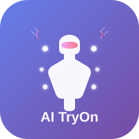

# Logo 使用说明

## Logo 文件说明

本项目包含以下logo文件：

### 1. 主Logo - `logo.svg`
- **尺寸**: 200x200px
- **用途**: 
  - 项目文档
  - 演示文稿
  - 宣传材料
  - 社交媒体头像

### 2. Favicon - `favicon.svg`
- **尺寸**: 32x32px
- **用途**: 
  - 浏览器标签页图标
  - 书签图标
  - 移动设备快捷方式图标

### 3. 横向Logo - `logo-horizontal.svg`
- **尺寸**: 400x80px
- **用途**: 
  - 网站顶部导航栏
  - 邮件签名
  - 文档页眉

## 设计理念

### 核心元素
1. **人形轮廓**: 代表虚拟试衣的核心功能
2. **渐变背景**: 紫色到蓝色的渐变，体现科技感和时尚感
3. **装饰圆点**: 象征AI技术的智能扫描和识别
4. **粉色点缀**: 增加时尚和活力元素

### 配色方案
- **主色调**: 紫色渐变 (#667eea → #764ba2)
- **强调色**: 粉色渐变 (#f093fb → #f5576c)
- **辅助色**: 白色 (用于图标和文字)

## 使用建议

### 前端项目使用

#### React项目
```jsx
import logo from './logo.svg';

function Header() {
  return (
    
  );
}
```

#### HTML使用
```html
<!-- 网站图标 -->
<link rel="icon" type="image/svg+xml" href="/favicon.svg">

<!-- 页面logo -->

```

### 文档使用
在Markdown文档中引用：
```markdown

```

## 品牌规范

### 最小尺寸
- 主Logo: 不小于 48x48px
- Favicon: 16x16px - 32x32px
- 横向Logo: 不小于 200x40px

### 安全间距
Logo周围应保持至少logo高度10%的留白空间

### 禁止事项
- ❌ 不要拉伸或变形logo
- ❌ 不要改变logo的颜色
- ❌ 不要在复杂背景上使用
- ❌ 不要添加阴影或其他效果

## 文件格式转换

如需PNG格式，可使用以下工具转换：
- [SVG to PNG Converter](https://svgtopng.com/)
- Adobe Illustrator
- Inkscape (免费)

推荐导出尺寸：
- 512x512px (高清版)
- 256x256px (标准版)
- 128x128px (缩略图)
- 64x64px (小图标)

## 版权说明

本logo为AI虚拟试衣系统项目专用，遵循MIT许可证。
